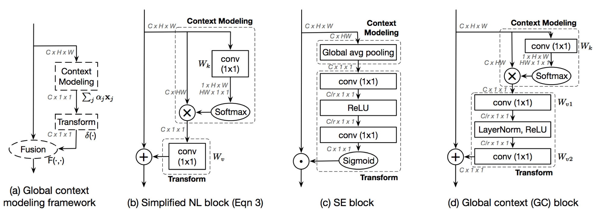

# GCNet-Tensorflow

<div align="center">
  
</div>

Simple Tensorflow implementation of ["GCNet: Non-local Networks Meet Squeeze-Excitation Networks and Beyond"](https://arxiv.org/abs/1904.11492)

## Summary
### Architecture


### Code
```python
def global_context_block(x, channels, use_bias=True, sn=False, scope='gc_block'):
    with tf.variable_scope(scope):
        with tf.variable_scope('context_modeling'):
            bs, h, w, c = x.get_shape().as_list()
            input_x = x
            input_x = hw_flatten(input_x)  # [N, H*W, C]
            input_x = tf.transpose(input_x, perm=[0, 2, 1])
            input_x = tf.expand_dims(input_x, axis=1)

            context_mask = conv(x, channels=1, kernel=1, stride=1, use_bias=use_bias, sn=sn, scope='conv')
            context_mask = hw_flatten(context_mask)
            context_mask = tf.nn.softmax(context_mask, axis=1)  # [N, H*W, 1]
            context_mask = tf.transpose(context_mask, perm=[0, 2, 1])
            context_mask = tf.expand_dims(context_mask, axis=-1)

            context = tf.matmul(input_x, context_mask)
            context = tf.reshape(context, shape=[bs, 1, 1, c])

        with tf.variable_scope('transform_0'):
            context_transform = conv(context, channels, kernel=1, stride=1, use_bias=use_bias, sn=sn, scope='conv_0')
            context_transform = layer_norm(context_transform)
            context_transform = relu(context_transform)
            context_transform = conv(context_transform, channels=c, kernel=1, stride=1, use_bias=use_bias, sn=sn, scope='conv_1')
            context_transform = sigmoid(context_transform)

            x = x * context_transform

        with tf.variable_scope('transform_1'):
            context_transform = conv(context, channels, kernel=1, stride=1, use_bias=use_bias, sn=sn, scope='conv_0')
            context_transform = layer_norm(context_transform)
            context_transform = relu(context_transform)
            context_transform = conv(context_transform, channels=c, kernel=1, stride=1, use_bias=use_bias, sn=sn, scope='conv_1')

            x = x + context_transform

        return x
```

### Usage
```python
from GCNet import *

x = global_context_block(x, channels=64, use_bias=True, sn=True, scope='gc_block')
```

## Related works
* [Tensorflow cookbook](https://github.com/taki0112/Tensorflow-Cookbook)
## Author
Junho Kim
